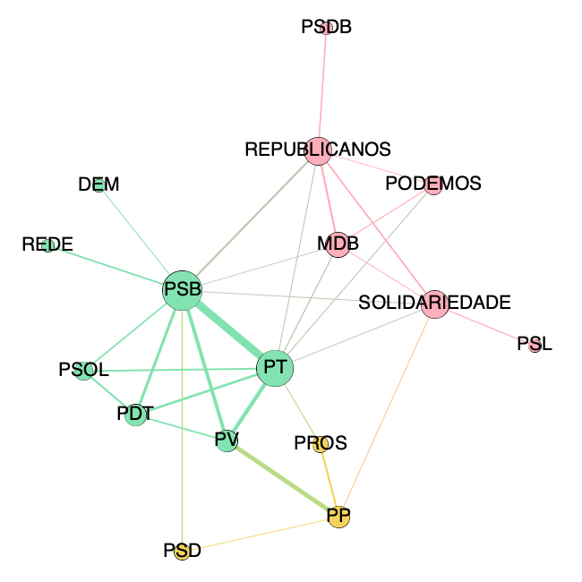

```{r setup, include=FALSE, echo=FALSE}
knitr::opts_chunk$set(
  echo = FALSE,
  message = FALSE,
  # fig.cap = '',
  warning = FALSE,
  # fig.align = 'center',
  fig.width = 8,
  fig.height = 5
)

Sys.setenv(LANGUAGE="pt-br")
Sys.setlocale("LC_TIME", "pt_BR")
options(scipen = 999)
```

```{r warning=FALSE, message=FALSE}
library(tidyverse)
library(ggbeeswarm)
library(ggchicklet)
library(hrbrthemes)
library(reactable)
theme_set(theme_ipsum_rc())

source(here::here("code/read_ready.R"))
source(here::here("reports/autorias.R"))
source(here::here("reports/escalas.R"))
source(here::here("reports/grafo.R"))
```

```{r}
proposicoes = read_proposicoes()
detalhes_autorias = read_autorias_det()
resumo_autorias = read_autorias_res() %>%  
  select(-sexo,
         -starts_with("id"))
```

## Proposições apresentadas em 2019 e 2020

Estamos examinando `r NROW(proposicoes)` proposições apresentadas em 2019 e 2020. Elas tem os seguintes tipos.

```{r fig.height=3}
proposicoes %>% 
  filter(!is.na(casa_origem)) %>% 
  count(casa_origem, sigla_tipo) %>% 
  ggplot(aes(x = reorder(casa_origem, n), y = n, fill = sigla_tipo)) + 
  geom_chicklet() + 
  coord_flip() + 
  labs(x = "", y = "Proposições", 
       title = "Proposições por casa de origem e tipo")
```


```{r}
proposicoes %>%
  mutate(mes = lubridate::floor_date(data_apresentacao, "months")) %>%
  count(mes) %>%
  ggplot(aes(x = mes, y = n)) +
  geom_chicklet(fill = "#ff8040") +
  scale_x_datetime(
    date_minor_breaks = "1 month",
    date_labels = "%b/%y"
  ) +
  labs(x = "Mês",
       y = "Proposições apresentadas",
       title = "Quando as proposições foram apresentadas")
```

Aqui o que foi apresentado em jan/19: 

```{r}
proposicoes %>%
  filter(
    lubridate::year(data_apresentacao) == 2019,
    lubridate::month(data_apresentacao) == 2
  ) %>% 
  select(Proposicao = nome_proposicao, Apresentada = data_apresentacao, Ementa = ementa) %>% 
  arrange(Apresentada) %>% 
  reactable(
    striped = T, searchable = T, compact = T
  )
```


```{r}
temas = proposicoes %>%
  separate_rows(tema, sep = ";") %>%
  mutate(tema = case_when(
    tema == "Meio ambiente" ~ "Meio Ambiente e Desenvolvimento Sustentável", 
    tema == "Agricultura, pecuária e abastecimento" ~ "Agricultura, Pecuária, Pesca e Extrativismo", 
    TRUE ~ tema 
  )) %>% 
  count(casa_origem, tema) 

temas %>%
  filter(!is.na(casa_origem)) %>% 
  ggplot(aes(x = reorder(tema, n), y = n)) +
  geom_col(fill = "#21a6a0") +
  facet_grid(. ~ casa_origem) + 
  coord_flip() +
  labs(
    x = "",
    y = "Proposições",
    title = "Por tema (do congresso)",
    subtitle = "Uma proposição pode ter mais de um tema"
  )
```

```{r}
temas %>% 
  filter(!is.na(casa_origem)) %>% 
  arrange(-n) %>% 
  reactable()
```

## Números de autores

Desconsideramos aqui as PECs. 

```{r}
participacao = detalhes_autorias %>%
  filter(!(sigla_tipo %in% c("PEC", "MPV"))) %>% 
  group_by(proposicao) %>% 
  filter(!is.na(partido)) %>% 
  summarise(autores = n(), 
            partidos = n_distinct(partido), 
            .groups = "drop")
```

### Quantidade de proposições com por número de autores

```{r}
participacao %>%
  mutate(
    num_autores = if_else(autores >= 12, "12+", as.character(autores)),
    x = if_else(autores >= 12, 12, round(autores))
  ) %>%
  count(num_autores, x) %>%
  arrange(x) %>% 
  select(Autores = num_autores, proposições = n) %>% 
  reactable(compact = T,
            striped = T)
```

```{r}
participacao %>% 
  top_n(15, autores) %>% 
  ggplot(aes(x = reorder(proposicao, autores), y = autores)) + 
  geom_chicklet(width = .5, fill = "#f7c74f") +
  coord_flip() + 
  labs(x = "", 
       title = "Proposições com mais autores")
```
```{r}
participacao %>% 
  select(proposicao, autores) %>% 
  arrange(-autores) %>% 
  left_join(proposicoes %>% select(nome_proposicao, ementa), 
            by = c("proposicao" = "nome_proposicao")) %>% 
  reactable(searchable = T)
```


```{r}
participacao %>% 
  filter(partidos >= 5) %>% 
  ggplot(aes(x = reorder(proposicao, partidos), y = partidos)) + 
  geom_hline(yintercept = 1, color = "#dddddd") + 
  geom_chicklet(width = .5, fill = "#f7c74f") +
  coord_flip() + 
  labs(x = "", 
       title = "Número de partidos entre autores", 
       subtitle = "Proposições que mobilizaram mais partidos")
```

# Grafo de coautoria dos partidos

Considerando a colaboração entre autores de diferentes partidos ao apresentar proposições (exceto PECs). As ligações são mais fortes se os partidos colaboraram mais, e excluímos ligações esporádicas. Os partidos são maiores se colaboraram mais no total. As cores mostram regiões da rede encontraaas via um algoritmo de agrupamento. 




```{r warning=FALSE}
nodes <- read_nos_partidos()
edges <- read_arestas_partidos() 

edges = edges %>% filter(peso_total_arestas >= .6)
# nodes = nodes %>%
#   filter(Id %in% edges$source | Id %in% edges$target)

generate_graph(data.frame(nodes), data.frame(edges))
```

